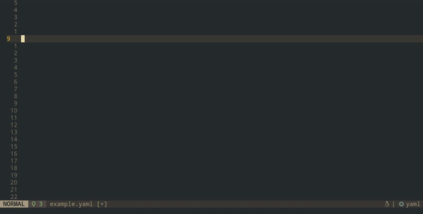

[](https://github.com/fabridamicelli/cronex.nvim/actions/workflows/ci.yml)

[](https://github.com/fabridamicelli/cronex.nvim/actions/workflows/update-downloads-count.yml)

If you find this work useful, don't forget to give it a GitHub ⭐ to help others find and trust it!

# cronex.nvim
Human-readable cron expressions in Neovim

## What is Cronex
Cronex is a Neovim plugin to asynchronously render in-line, human-readable explanations of [cron expressions](https://en.wikipedia.org/wiki/Cron):

[Here's a short introduction video](https://www.youtube.com/live/Se8SKgmCnkc?t=31717s).



This plugin is **not** a cron expression parser/checker by itself.
Cronex is rather the "client" that allows the Neovim user to integrate and customize "servers" (cron expression "explainers") in a flexible fashion, with fully asynchronous non-blocking API.
There are several implementations of those out there (see below).
You can use any of those with Cronex.

## Getting Started
### Dependencies
Since version 0.2.0, `cronex.nvim` depends on `Neovim >= v0.10`.
If you're using `Neovim v0.9.*` pin `cronex to 0.1.3` (see below under `Installation`).


You will need a cron expression explainer installed.
The default is [cronstrue](https://www.npmjs.com/package/cronstrue), which is the one used by the [vscode package `cron-explained`](https://marketplace.visualstudio.com/items?itemName=tumido.cron-explained).

[Install the `cronstrue` library](https://www.npmjs.com/package/cronstrue) and make sure that the command `cronstrue` is available in the environment where your buffer is being shown.

That will use the `cronstrue` library under the hood to generate the explanations.

### Installation
Using [lazy.nvim](https://github.com/folke/lazy.nvim)

```lua
-- init.lua:
{
'fabridamicelli/cronex.nvim',
opts = {}, 
}

-- Or
-- plugins/cronex.lua:
return {
    'fabridamicelli/cronex.nvim',
    opts = {},
}
```

If you are using `Neovim v0.9.*`, tag to earlier versions like so:

```lua
-- init.lua:
{
'fabridamicelli/cronex.nvim',
tag = "0.1.3",
opts = {}, 
}
```

Using [vim-plug](https://github.com/junegunn/vim-plug)

```viml
call plug#begin()
Plug 'fabridamicelli/cronex.nvim'
call plug#end()

lua <<EOF
require("cronex").setup({})
EOF
```

## Usage
Calling setup makes the explainer available and set explanations when leaving insert mode.  
Entering insert mode clears the explanations.
Cronex can be also disabled/enabled on any file (see Commands).

### Commands
The setup will make the following commands available:

|Command                | Description                                                    |
|-----------------------|----------------------------------------------------------------|  
|`CronExplainedDisable` | Turn off the explanations permanently                          |
|`CronExplainedEnable`  | Turn on the explanations again (regardless of filetype)        |


## Customization

### Cronex setup structure
The plugin consists of three building blocks:  

| Module     | Description                                                               |
|------------| --------------------------------------------------------------------------|
|`extractor` | Logic to extract cron expressions from current buffer                     |
|`explainer` | Program that will parse and explain the cron expressions                  |
|`format`    | Postprocess the output string produced by the explainer for final display |

Default configuration:
```lua
require("cronex").setup({
    -- The plugin will automatically start (with autocommand) for these types of files.
    -- User can manually on any filetype turn explanations on(off) with the commands CronExplainedEnable(CronExplainedDisable)
    file_patterns = { "*.yaml", "*.yml", "*.tf", "*.cfg", "*.config", "*.conf" },
    extractor = { -- Configuration on how to extract cron expressions goes here:
        -- cron_from_line: Function to search cron expression in line 
        cron_from_line = require("cronex.cron_from_line").cron_from_line,
        -- extract: Function returning a table with pairs (line_number, cron)
        extract = require("cronex.extract").extract,
        },
    explainer = { -- Configuration on how to explain one cron expression goes here
        -- Command to call an external program that will translate the cron expression
        -- eg: "* * * * *" -> Every minute
        -- Any command that is available in your command line can be used here.
        -- examples:
        -- "/path/to/miniconda3/envs/neovim/bin/cronstrue" (point to a conda virtualenv)
        -- "python explainer.py" (assuming you have such a python script available)
        cmd = "cronstrue",  -- or a table, eg: cmd = {"bash", "./my-cron-script.sh"}
        -- Optional arguments to pass to the command
        -- eg: "/path/to/a/go/binary"  (assuming you have a go binary)
        -- args = { "-print-all" }  (assuming the program understands the flag 'print-all')
        args = {},
        --Timeout in milliseconds to wait for the command to finish.
        -- Cronex will throw a notification message if you run into a timeout.
        timeout = 10000,
    },
    -- Configure the post-processing of the explanation string.
    -- eg: transform "* * * * *": Every minute --to--> Every minute
    -- using require("cronex.format").all_after_colon,
    format = function(s)
        return s
    end
})
```

To embed the above configuration code snippet in a `.vim` file
(for example in `init.vim`),
wrap it in `lua << EOF code-snippet EOF`:

```lua
lua << EOF
require('cronex').setup{
  -- ...
}
EOF
```

Look [here](/examples) for more config examples.

### Extractor
Logic of the default extractor can be found here in `/cronex/cron_from_line.lua`.  
Default extractor searches for at most 1 expression per line of length 7, 6 or 5 (in that order).  
But Cronex allows the user to hook in and swap this by any arbitrary logic.  

The extractor has 2 parts: `cron_from_line` and `extract`, both are functions.  
You can swap any or both of the two with custom functions, provided you respect the following interfaces:

`cron_from_line`: Function with signature `string -> string|nil`.
 Returns the cron expression if found (else `nil`)

`extract`: Function with signature `function -> table`
The input `function` processes each buffer line (may be identity, i.e. just return line as is).
Output `table` of pairs (`line_number`, `cron_expression`), empty if no cron expressions found.

Here's a toy example on how to customize the functions, that will set "line <LINE_NUMBER> says --> hello world" on every line of the buffer:
```lua
require("cronex").setup({
    extractor = {
        cron_from_line = function(_)
            -- This commented block is what you would actually do in a real scenario
            -- local cron = do_something_to_extract_cron(buffer_line)
            -- if cron then
            --     return cron
            -- end
            -- return nil
            return "hello world" -- let's hard-code something :)
        end,
        extract = function(cron_from_line)
            local t = {}
            for i, line in ipairs(vim.api.nvim_buf_get_lines(0, 0, -1, false)) do
                t[i - 1] = string.format("line %s says --> %s ", i - 1, cron_from_line(line))
            end
            return t
        end
    },
    explainer = {
        cmd = "echo" -- just echo the what extract produces
    },
})
```
Under the hood, `cron_from_line` will be passed to `extract` like so:
```lua
extract(cron_from_line)
```
This allows you to plug a custom function to extract cron from line and still use the default `extract` function

You may even just set `cron_from_line` to `nil` and use the `extract` function to send the whole buffer to another program from which you capture the output.
All that matters is that `extract` returns the table with pairs (`line_number`, `cron_expression`).
For example:
```lua
{
    require("cronex").setup({
        extractor = {
            cron_from_line = nil,
            extract = function(_)
                local t = {}
                local out = send_buffer_to_external_program_and_collect_crons()
                for lnum, cron in out do
                    t[lnum] = cron
                end
                return t
            end
        }

    })
}
```

### Explainer
As already mentioned above, Cronex integrates the functionality of external cron expression explainers into Neovim.
There are several implementations of those out there.

More generally, it's up to the user which explainer program to use in the background.
Cronex will call such program via the command (`cmd`), collect the output and pass it along to Neovim.  
This is the default:
```lua
require("cronex").setup({
    explainer = {
        cmd = "cronstrue",
        args = {},
        timeout = 10000
    } 
})
```
For example, you can have `cronstrue` installed in a conda virtualenv.
If the virtualenv is active, everything should work out of the box.
But you may not want to install `cronstrue` in every virtualenv, so you can have only one central environment with `cronstrue` installed and point to that binary explicitly in the config:
```lua
{
    require("cronex").setup({
    explainer = {
        cmd = "/home/username/miniconda3/envs/neovim/bin/cronstrue"
    })
}
```
In fact `cmd` can call anything that knows how to deal with the cron expression. 
For example, calling a go program:
```lua
{
    require("cronex").setup({
        explainer = {
            cmd = { "go", "run", "/path/to/go/app/cmd/module/main.go" },
            -- or if you pre-compiled it (recommended):
            -- cmd = { "/path/to/go/app/cmd/module/binary" },
            args = { "-arg1", "-arg2" }
        }
    })
}
```

Here are a few of those third-party libraries as well as the Cronex command to use them:

***`cronstrue:`***
This is the default explainer by Cronex and the very same library used by the [vscode package `cron-explained`](https://marketplace.visualstudio.com/items?itemName=tumido.cron-explained).
You need first install the [`cronstrue` library](https://www.npmjs.com/package/cronstrue) and make sure that the command `cronstrue` is available in the environment where your buffer is being shown.
For example, you can use it inside of a Python virtual environment (in this case managed by conda to install `nodejs`):
```bash
conda create -n venv
conda activate venv
conda install nodejs -c conda-forge
npm install cronstrue
```
After that `cronstrue` will only be installed inside `venv` (thus only available there).

#### Calling the explainer running in docker container
You could even call the program running in a docker container using a dockerfile like this:
```Dockerfile
FROM node:lts-alpine@sha256:ad1aedbcc1b0575074a91ac146d6956476c1f9985994810e4ee02efd932a68fd
RUN npm install -g cronstrue@2.50.0
ENTRYPOINT [ "/usr/local/bin/cronstrue" ]
```

building the image:
```bash
docker build -t cronstrue -f Dockerfile .
```

and configuring the plugin like so:
```lua
{
"fabridamicelli/cronex.nvim",
opts = {
    explainer = {
        cmd = "docker",
        args = { "run", "-i", "--rm", "cronstrue:latest" },
    }
},
}
```


***`hcron:`***
This explainer is written in Go and much considerably faster than the default.
But it is not as widely used and the project does not seem to be that well maintained.
Recommendation: Compile the binary

Here's a (non-exhaustive) overview cron explainers out there:
| Language   | Link                                                    |
|------------| --------------------------------------------------------|
| JavaScript | https://github.com/bradymholt/cronstrue                 |
| Go         | https://github.com/lnquy/cron                           |
| Python     | https://github.com/Salamek/cron-descriptor              |
| .NET       | https://github.com/bradymholt/cron-expression-descriptor|
| Java       | https://github.com/grahamar/cron-parser                 |
| Rust       | https://github.com/zslayton/cron                        |


### format
We might want to modify the output from the third-party explainer libraries.
For example, some explainers show the input as well in the output like so:
```
"* * * * *": Every minute
```
In that case, you could use the function `require("cronex.format").all_after_colon`) to transform the output to just show "Every minute".  
But the user can do any other transformation by defining a lua function, for example:
```lua
{
    require("cronex").setup({
        format = function(explanation)
            local colon = string.find(explanation, ": ")
            if colon then
                return "Human-readable:" .. string.sub(explanation, colon + 2)
            end
            return explanation
        end
        })
}
```
That will transform it like this:

```
"* * * * *": Every minute --> Human-readable: Every minute
```

## Limitations
- Some terminals might make the cron explanations (diagnostic hints) flicker on the first call (only if you have many of them, but for most users this will not be noticeable).
The current `extract` logic is a bit rudimentary (partly because regex in lua are a bit trickier than normal (at least for me).
Any improvement along those lines is more than welcome.

The Go implementation of the explainer is so fast that even having hundreds of expressions in a buffer everything runs decently fast.  
Potential ideas to improve performance:
- Accelerating extraction, for example, by using `ripgrep` to extract all crons in one shot (instead of iterating over lines)
- Implementing the explainer in pure lua to avoid external calls

## Troubleshooting
- Default behaviour considers only 1 cron expression is per line.
So having repeated expressions in one line will result in no explanation at all.
I haven't seen use-cases where it makes sense to have more than one, but I'd be open to consider it if that makes sense.
- If encountering problems with an expression, disable the format in order to see the exact output coming from the explainer

## TODO
- add stylua linter
- make screencast gif
- Accept diagnostics config? (nvim 0.11)
- add command timeout
- ci: new version only nvim >0.10
- add config example with custom diagnostic prefix

- config notification symbol?
- ripgrep extraction?
- add proper docs
- test call in CI